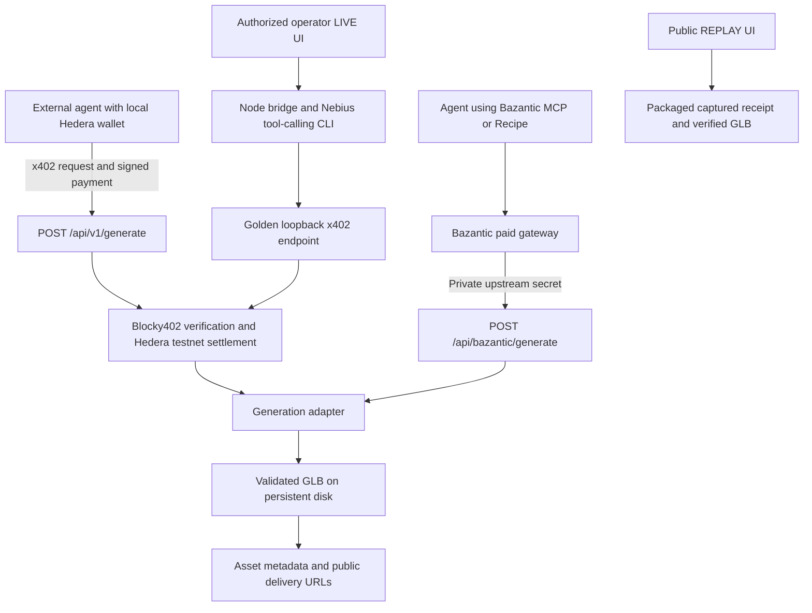

# Mesh402

**Agent-native 3D infrastructure.**

AI agents can already search, write code and transact. Mesh402 lets them autonomously purchase and consume generative 3D as a service: describe an asset, pay for the capability, receive a downloadable GLB.

Agents shouldn't subscribe to tools. They should buy capabilities.

[Live demo](https://mesh402.onrender.com/) · [Public API spec](https://mesh402.onrender.com/openapi.json) · [Bazantic upstream spec](https://mesh402.onrender.com/bazantic-openapi.json) · [ETHGlobal showcase](https://ethglobal.com/showcase/mesh402-44xi1)

## See the proof

Open the demo and choose **REPLAY**. It presents captured evidence from a real autonomous purchase: Nebius selected a tool, a Hedera testnet payment settled through Blocky402, a generation completed, and the resulting GLB was delivered. Replay is public and performs no inference, payment or new generation. The chamber displays an optimized derivative of that actual asset.

**LIVE** is a separate operator-protected execution path. It runs the existing agent CLI and streams real execution milestones to the interface. It is not an anonymous free-generation button.

| Evidence | Link |
| --- | --- |
| Autonomous street-food-cart purchase | [Hedera transaction](https://hashscan.io/testnet/transaction/0.0.7162784@1789266602.685455064) |
| Browser LIVE delivery-robot-kiosk purchase | [Hedera transaction](https://hashscan.io/testnet/transaction/0.0.7162784@1789270138.000728046) |
| Captured autonomous-run metadata | [Versioned replay manifest](frontend/public/assets/replay/manifest.json) / [public receipt](https://mesh402.onrender.com/demo/receipt) |
| Actual replay GLB | [Download](https://mesh402.onrender.com/assets/replay/street-food-cart.optimized.glb) / [optimization provenance and hashes](docs/REPLAY-ASSET.md) |
| x402 verification and settlement implementation | [Permanent code reference](https://github.com/ValenteCreativo/mesh402/blob/cfce73ae457f4c958e8cdd050042348e85b117ff/src/x402/server.ts#L70-L118) |
| Public caller-paid API | [Payment boundary and asset delivery](https://github.com/ValenteCreativo/mesh402/blob/cfce73ae457f4c958e8cdd050042348e85b117ff/server/public-api/route.ts#L70-L132) |
| Bazantic upstream | [Secret authentication and direct generation](https://github.com/ValenteCreativo/mesh402/blob/d041de59e8b27a8d06c4c92a76de654d1671fb67/server/bazantic/route.ts#L46-L84) |

The autonomous replay records 20 provider credits, a 41,331,488-byte original GLB, and a 7,961,160-byte web derivative. The subsequent browser LIVE run delivered a separate 41,657,756-byte GLB in 170.372 seconds. Raw receipts and original assets remain private under `generated/`; the versioned manifest preserves public proof without secrets or expiring provider URLs.

These are the captured operator/agent runs. They do not establish a completed external caller-paid or Bazantic gateway run. Those routes have separate mocked contract and safety tests.

## Public API quickstart

```http
POST https://mesh402.onrender.com/api/v1/generate
Content-Type: application/json

{ "prompt": "low-poly modular lunar repair drone, game-ready" }
```

**No Mesh402 account. No provider API key. Your caller wallet stays local.** Use a funded Hedera testnet ECDSA account. The current capability costs **100,000 tinybars / 0.001 HBAR**; the caller validates the actual payment offer before signing.

Clone the repository and install with Node **22.23.2** (the version in `.node-version`):

```sh
git clone https://github.com/ValenteCreativo/mesh402.git
cd mesh402
npm ci
```

Create an ignored `.env.caller.local` on the caller's machine:

```dotenv
MESH402_API_URL=https://mesh402.onrender.com/api/v1/generate
CALLER_HEDERA_ACCOUNT_ID=<your funded ECDSA testnet account>
CALLER_HEDERA_PRIVATE_KEY=<your local caller private key>
CALLER_EXPECTED_PAY_TO=0.0.10509474
```

The recipient is an optional trust pin; independently confirm it before funding a request. Do not configure the caller private key on Render, in the gateway, or in browser code.

**The following command makes a real payment and consumes generation credits. Run once only when you intend to acquire a new asset:**

```sh
npm run example:external-agent -- "low-poly modular lunar repair drone, game-ready"
```

The [native TypeScript caller](examples/external-agent.ts) performs the handshake automatically, uses the existing Hedera SDK to sign locally, checks the returned settlement, and prints asset metadata. An initial request receives 402 only when the service is enabled, configured, idle and below quota; otherwise it can fail before requesting payment.

Successful response fields:

| Fields | Meaning |
| --- | --- |
| `status` | `success` after generation and persistence |
| `network`, `price`, `amountTinybars` | `hedera:testnet`, `0.001 HBAR`, `100000` |
| `transactionId`, `payer`, `recipient` | Settlement identity and accounts |
| `verificationValid`, `settlementSuccess` | Confirmed verification and settlement |
| `taskId`, `prompt`, `creditsConsumed` | Generation identity, trimmed prompt and credits (nullable) |
| `assetUrl`, `receiptUrl`, `glbBytes` | Stable public GLB URL, sanitized receipt URL and file size |

The request accepts only `prompt`: nonblank, at most 2000 JavaScript UTF-16 code units, with a 16 KB JSON body limit. See the [full API contract and error codes](docs/PUBLIC-API.md).

## Two ways to buy the capability

### Direct Hedera / x402

```text
Request → HTTP 402 → caller signs with Hedera wallet → paid retry
        → Blocky402 verifies and settles → generation → HTTP 200 + GLB URL
```

Mesh402 discovers live Blocky402 `/supported` capabilities. The initial response includes x402 v2 requirements in both JSON and the base64 `PAYMENT-REQUIRED` header. The caller checks network, amount, asset, recipient, fee payer and transaction contents, then sends one `PAYMENT-SIGNATURE` request. The response includes a `PAYMENT-RESPONSE` settlement receipt. No operator session or operator payer is used by this endpoint.

### Bazantic MCP / Recipe

The published Bazantic Recipe **Generate Custom 3D Asset from Description** selects `generateBazantic3DAsset` and instructs the model to invoke it once. Its instructions turn an object description and optional style/use into a generation prompt, then return the asset URL, receipt URL and task ID. [Recipe configuration](https://bazantic.com/dashboard/recipes/generate-custom-3d-asset-from-description) requires Bazantic access.

```text
Agent / MCP / Recipe → Bazantic paid gateway
                    → authenticated Mesh402 upstream → generation → GLB URL
```

Configure Bazantic with:

| Setting | Value |
| --- | --- |
| API Base URL | `https://mesh402.onrender.com` |
| Dedicated OpenAPI URL | `https://mesh402.onrender.com/bazantic-openapi.json` |
| Upstream resource | `POST /api/bazantic/generate` |
| Private upstream header | `X-Bazantic-Upstream-Secret` |
| Matching Render variable | `BAZANTIC_UPSTREAM_SECRET` |

Bazantic owns its payment check and privately injects the header. This upstream calls the generation adapter directly and does **not** charge a second Mesh402 Hedera payment. It returns the same asset metadata fields without inventing Hedera settlement evidence. Missing/wrong credentials are rejected; no secret goes to the caller or frontend.

The repository supplies the upstream and its spec, not a standalone MCP server. Gateway/MCP connection details and Recipe publication are managed in Bazantic. A published Recipe is not evidence of a successful paid run. Bazantic's Recipe test can invoke the upstream even when its UI says “No payment occurs”; that can still consume provider credits. See [gateway setup, retry constraints and storage](docs/BAZANTIC.md).

## Architecture



TypeScript and native Node HTTP/fetch keep the backend small. Vite and Three.js provide the machine interface. Nebius/Qwen is the reference autonomous consumer; external agents can use their own reasoning stack. The current provider adapter uses Tripo v3 behind a `generateAsset(prompt)` boundary. Provider choice is an implementation detail; replacing it would require another adapter, not a different capability-purchase model.

One persistent Render Node service serves the frontend, API and registered assets. GLBs are downloaded immediately because provider URLs expire. Public URLs remain usable while the service and persistent disk retain the registered files. There is no database, durable job queue or multi-instance coordinator.

## Local setup

For the public replay, no keys are required:

```sh
npm ci
npm run build:visual
npm start
# Open http://127.0.0.1:4020
```

Use `npm run dev:visual` for Vite UI development; use `npm start` to exercise the production wrapper and its public/Bazantic routing. Stop the other server first if port 4020 is occupied.

For server-side capabilities, create `.env.local` from [.env.example](.env.example) and configure only what you need. For local operation set `NODE_ENV=development` and `PUBLIC_ORIGIN=http://127.0.0.1:4020`.

| Capability | Server configuration |
| --- | --- |
| Replay | No service keys |
| Public Hedera API | `PUBLIC_API_ENABLED=true`, `HEDERA_PAY_TO_ACCOUNT_ID`, `TRIPO_API_KEY`; quota/concurrency settings in `.env.example` |
| Bazantic upstream | `BAZANTIC_UPSTREAM_SECRET`, `TRIPO_API_KEY` |
| Operator agent demo | `LIVE_OPERATOR_SECRET`, `NEBIUS_API_KEY`, `NEBIUS_BASE_URL`, `NEBIUS_MODEL`; payer/recipient and provider credentials for live mode |

Operator mode defaults to `MESH402_UI_EXECUTION=dry-run`. The configured Nebius model is `Qwen/Qwen3-235B-A22B-Instruct-2507`. An agent dry run uses real LLM inference, but no payment or 3D generation. Operator LIVE requires explicit mode configuration, authentication and spend consent. See [Render deployment and recovery](docs/DEPLOYMENT.md) for disk mounting, exact environment values and operator sessions.

## Validation and retry safety

These commands use mocks and do not submit payments, generate assets or call an LLM:

```sh
npm run typecheck
npm run test:agent:guards
npm run test:public-api
npm run test:bazantic
npm run test:wrapper
npm run build:visual
```

`test:tripo`, `test:x402`, `test:e2e`, `example:external-agent`, and agent `--live` are spending commands, not routine test-suite checks. `test:x402` also generates an asset now.

- **One deliberate invocation.** The reference agent permits at most one tool execution. Its final response has no tools, so truncation cannot start another paid call.
- **No automatic paid retries.** Generation can take several minutes. A timeout or disconnect does not cancel a remote task or establish that settlement failed. Stop and reconcile transaction, task and stored evidence.
- **Persistent failure boundaries.** The public API preserves quota and payment-attempt state; the operator bridge and Bazantic upstream retain execution locks after ambiguous failures. Never delete a lock merely to make an error disappear.
- **No automatic refunds.** Payment can settle before generation fails. Bazantic must disable automatic upstream retries; no gateway payment-ID idempotency contract is implemented yet.
- **Separate funding paths.** Do not put Bazantic's paid gateway in front of the already-paid `/api/v1/generate`. Use its dedicated upstream to avoid double charging.
- **Separate secrets.** Caller keys remain in `.env.caller.local`; service/operator keys remain server-side. Raw receipts and generated assets stay ignored. Only registered sanitized receipts and assets are delivered publicly.

If only the final Nebius wording was truncated after a successful tool result, `npm run finalize:agent` reads the saved receipt and performs a tools-disabled LLM finalization. It never pays or generates again, but it does use LLM inference.

## ETHOnline 2026

Built for **ETHGlobal ETHOnline 2026** to demonstrate a machine-purchasable capability: **real payment → real generation → real GLB**. Hedera and Blocky402 supply the direct settlement path; Nebius supplies the reference decision-making agent; Bazantic supplies the separate gateway/MCP/Recipe integration surface.

Development history preserves the milestones instead of flattening them: [`mvp-e2e`](https://github.com/ValenteCreativo/mesh402/tree/mvp-e2e) freezes the paid generation path and [`backend-complete`](https://github.com/ValenteCreativo/mesh402/tree/backend-complete) preserves the completed agent backend. Subsequent UI, deployment, public API and Bazantic work remains in separate commits.

The Tripo polling adapter was informed by [PromptMon's integration pattern](https://github.com/Gastonfoncea/Promptmon/blob/main/tripo/src/client.ts), adapted to the current v3 schema. No game, NFT or minting architecture was reused. Font licenses and replay provenance remain in the repository.
